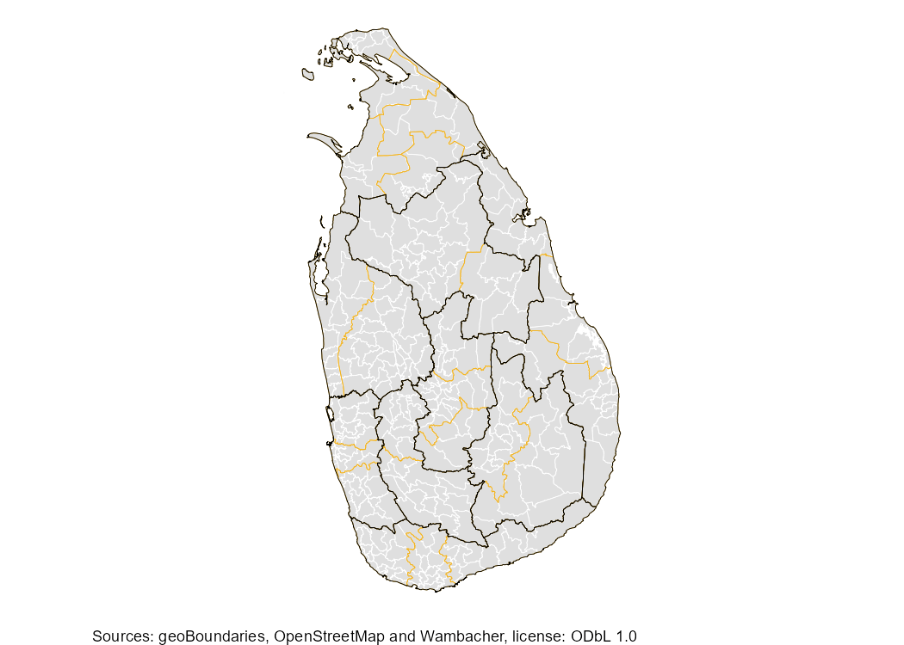
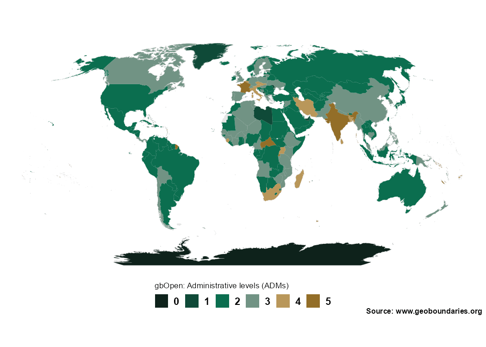

<!-- README.md is generated from README.qmd. Please edit that file -->

# geobounds <a href="https://dieghernan.github.io/geobounds/"></a>

<!-- badges: start -->

[](https://CRAN.R-project.org/package=geobounds)
[](https://cran.r-project.org/web/checks/check_results_geobounds.html)
[](https://CRAN.R-project.org/package=geobounds)
[](https://dieghernan.r-universe.dev/geobounds)
[](https://github.com/dieghernan/geobounds/actions/workflows/check-full.yaml)
[](https://app.codecov.io/gh/dieghernan/geobounds)
[](https://www.codefactor.io/repository/github/dieghernan/geobounds)
[](https://doi.org/10.32614/CRAN.package.geobounds)
[](https://www.repostatus.org/#active)

<!-- badges: end -->

> [!IMPORTANT]
>
> [Attribution](https://www.geoboundaries.org/index.html#usage) is
> required when using geoBoundaries.

## Why this package?

The **geobounds** package provides an **R**-friendly interface to access
and work with the [**geoBoundaries**](https://www.geoboundaries.org/)
dataset (an open-license global database of administrative boundary
polygons). Using this package, you can:

- Programmatically retrieve administrative boundary geometries (e.g.,
  country → region → district) from geoBoundaries
- Use **tidyverse** / **sf** workflows in **R** to map, analyze, and
  join these boundaries with your own data
- Work in an open-data context (geoBoundaries uses [CC
  BY-4.0](https://creativecommons.org/licenses/by/4.0/)) and open
  licenses.

In short: if you work with geospatial boundaries in **R** (shapefiles,
polygons, and joining with other data), this package simplifies the
process.

## Installation

Install **geobounds** from
[**CRAN**](https://CRAN.R-project.org/package=geobounds):

``` r
install.packages("geobounds")
```

<div class="pkgdown-devel">

Check the docs of the developing version in
<https://dieghernan.github.io/geobounds/dev/>

You can install the developing version of **geobounds** with:

``` r
# install.packages("pak")
pak::pak("dieghernan/geobounds")
```

Alternatively, you can install **geobounds** using the
[r-universe](https://dieghernan.r-universe.dev/geobounds):

``` r
# Install geobounds in R:
install.packages(
  "geobounds",
  repos = c(
    "https://dieghernan.r-universe.dev",
    "https://cloud.r-project.org"
  )
)
```

</div>

## Example usage

``` r
library(geobounds)

sri_lanka_adm1 <- gb_get_adm1("Sri Lanka")
sri_lanka_adm2 <- gb_get_adm2("Sri Lanka")
sri_lanka_adm3 <- gb_get_adm3("Sri Lanka")

library(sf)
library(dplyr)

library(ggplot2)

ggplot(sri_lanka_adm3) +
  geom_sf(fill = "#DFDFDF", color = "white") +
  geom_sf(data = sri_lanka_adm2, fill = NA, color = "#F0B323") +
  geom_sf(data = sri_lanka_adm1, fill = NA, color = "black") +
  labs(caption = "Source: www.geoboundaries.org") +
  theme_void()
```



## Data types

geoBoundaries offers different release types with varying levels of
validation and licensing:

- **gbOpen**: Freely available boundaries under CC BY 4.0, suitable for
  most applications
- **gbHumanitarian**: Boundaries validated for humanitarian work,
  ensuring accuracy for aid distribution
- **gbAuthoritative**: Official government boundaries, highest accuracy
  but may have restrictions

Use the `release_type` parameter in functions to specify, e.g.,
`gb_get_adm1("Sri Lanka", release_type = "gbHumanitarian")`.

For detailed comparisons, see the vignettes.

## Advanced usage

Get a map with the level of coverage of geoBoundaries by country:

``` r
library(geobounds)
library(ggplot2)
library(dplyr)

world <- gb_get_world()
max_lvl <- gb_get_max_adm_lvl(release_type = "gbOpen")

world_max <- world |>
  mutate(boundaryISO = shapeGroup) |>
  left_join(max_lvl) |>
  mutate(max_lvl = factor(maxBoundaryType, levels = 0:5))

pal <- c("#0e221b", "#0f4a38", "#0b6e4f", "#719384", "#b9975a", "#936e28")
names(pal) <- levels(world_max$max_lvl)

ggplot(world_max) +
  geom_sf(fill = "#e5e5e5", color = "#e5e5e5") +
  geom_sf(aes(fill = max_lvl), color = "transparent") +
  scale_fill_manual(values = pal, na.translate = FALSE, drop = FALSE) +
  guides(fill = guide_legend(direction = "horizontal", nrow = 1)) +
  coord_sf(expand = TRUE, crs = "+proj=robin") +
  theme_void() +
  theme(
    plot.background = element_rect(fill = "white", color = NA),
    text = element_text(family = "sans", face = "bold"),
    legend.position = "bottom",
    legend.title.position = "top",
    legend.title = element_text(size = rel(0.75), face = "plain"),
    legend.text = element_text(size = rel(1)),
    legend.text.position = "right",
    legend.key.height = unit(1, "line"),
    legend.key.width = unit(1, "line"),
    plot.caption = element_text(
      size = rel(0.7),
      margin = margin(r = 4)
    )
  ) +
  labs(
    fill = "gbOpen: Administrative Divisions (ADMs)",
    caption = "Source: www.geoboundaries.org"
  )
```



## Documentation and resources

- Visit the **pkgdown** site for full documentation:
  <https://dieghernan.github.io/geobounds/>
- Vignettes on data releases:
  - [gbOpen](https://dieghernan.github.io/geobounds/articles/gbopen.html)
  - [gbHumanitarian](https://dieghernan.github.io/geobounds/articles/gbhumanitarian.html)
  - [gbAuthoritative](https://dieghernan.github.io/geobounds/articles/gbauthoritative.html)
- Explore the geoBoundaries homepage: <https://www.geoboundaries.org/>
- Read the original paper describing the geoBoundaries dataset ([Runfola
  et al. 2020](#ref-10.1371/journal.pone.0231866)).
- Report issues or contribute on
  [GitHub](https://github.com/dieghernan/geobounds)

## License

This package is released under the [CC
BY-4.0](https://creativecommons.org/licenses/by/4.0/) license. Note that
the boundary data being accessed (via geoBoundaries) also uses open
licenses; please check the specific dataset metadata for licensing
details.

## Acknowledgements

- Many thanks to the geoBoundaries team and the [William & Mary
  geoLab](https://sites.google.com/view/wmgeolab/) for creating and
  maintaining the dataset.
- Thanks to the **R** package community and all contributors to this
  package’s development.
- If you use **geobounds** (and underlying geoBoundaries data) in your
  research or project, a citation and acknowledgment is greatly
  appreciated.

## Citation

<p>

Hernangómez D (2026). <em>geobounds: Download Map Data from
geoBoundaries</em>.
<a href="https://doi.org/10.32614/CRAN.package.geobounds">doi:10.32614/CRAN.package.geobounds</a>,
<a href="https://dieghernan.github.io/geobounds/">https://dieghernan.github.io/geobounds/</a>.
</p>

A BibTeX entry for LaTeX users:

    @Manual{R-geobounds,
      title = {{geobounds}: Download Map Data from geoBoundaries},
      author = {Diego Hernangómez},
      year = {2026},
      version = {0.1.1},
      url = {https://dieghernan.github.io/geobounds/},
      abstract = {Tools to download data from geoBoundaries <https://www.geoboundaries.org/>. Several administration levels available. See Runfola, D. et al. (2020) geoBoundaries: A global database of political administrative boundaries. PLOS ONE 15(4): 1-9. <doi:10.1371/journal.pone.0231866>.},
      doi = {10.32614/CRAN.package.geobounds},
    }

## References

<div id="refs" class="references csl-bib-body hanging-indent">

<div id="ref-10.1371/journal.pone.0231866" class="csl-entry">

Runfola, Daniel, Austin Anderson, Heather Baier, et al. 2020.
“<span class="nocase">geoBoundaries</span>: A Global Database of
Political Administrative Boundaries.” *PLOS ONE* 15 (4): 1–9.
<https://doi.org/10.1371/journal.pone.0231866>.

</div>

</div>
