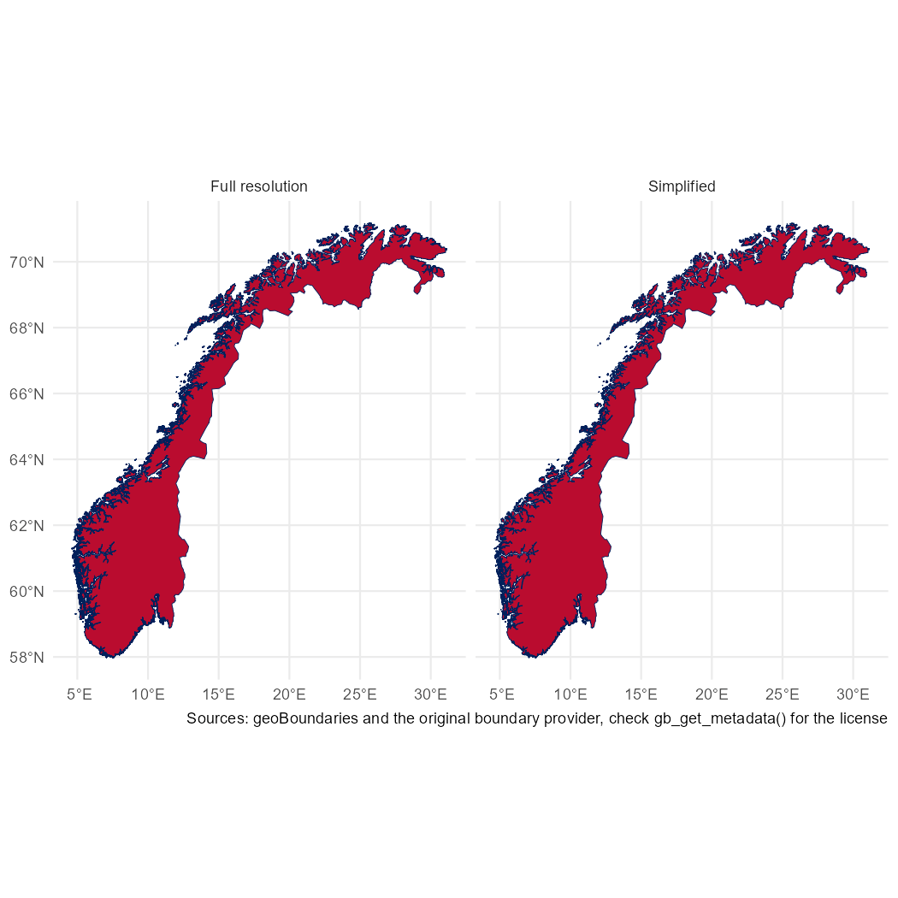
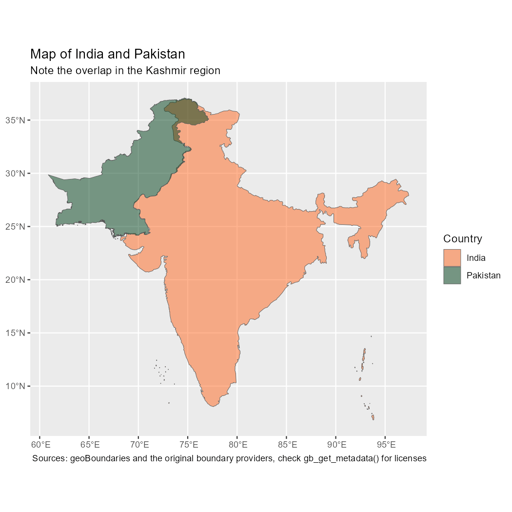
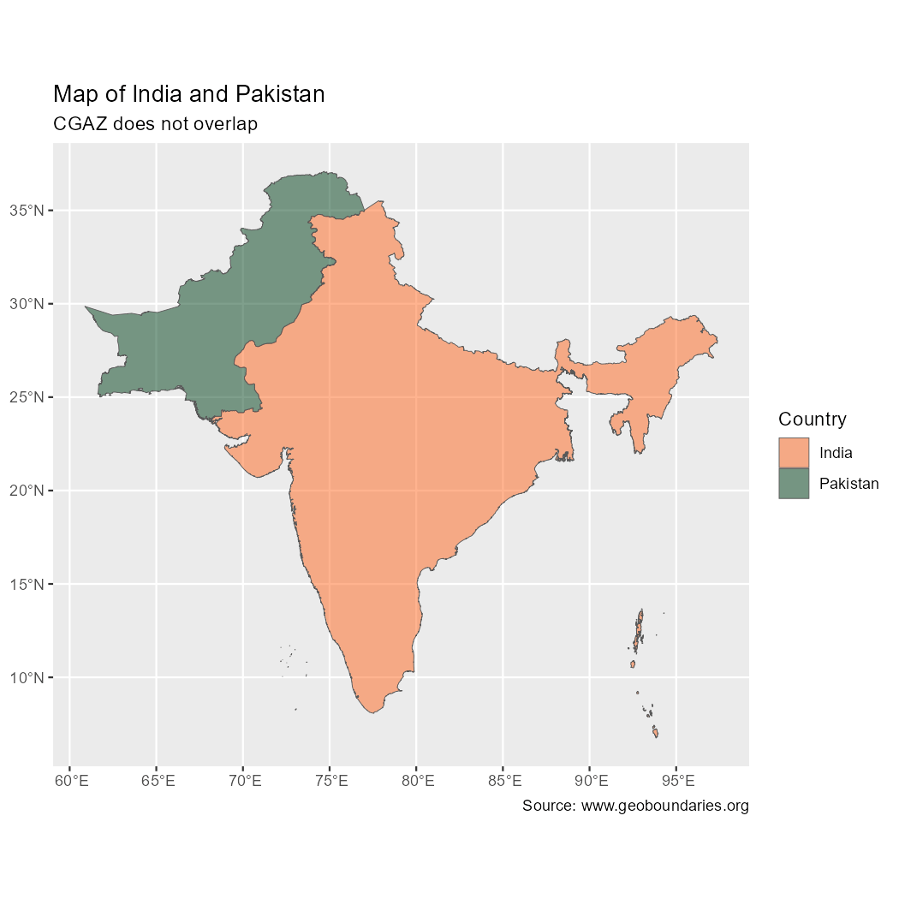
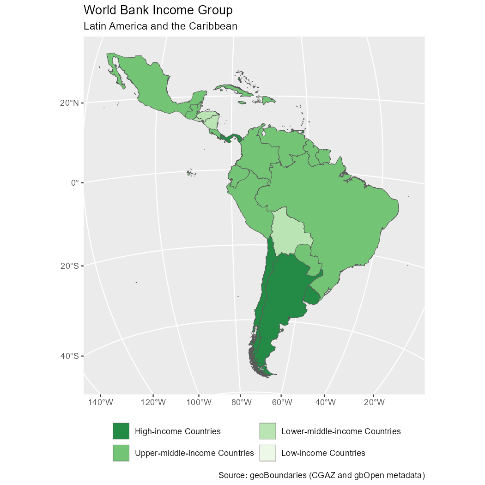

<!-- geobounds.qmd is generated from geobounds.qmd.orig. Please edit that file -->


```{=html}
<div class="callout callout-style-default callout-important callout-titled">
<div class="callout-header d-flex align-content-center">
<div class="callout-icon-container"><i class="callout-icon"></i></div>
<div class="callout-title-container flex-fill">Important</div>
</div>
<div class="callout-body-container callout-body">
```

[Attribution](https://www.geoboundaries.org/index.html#usage) is required when
using geoBoundaries.

```{=html}
</div>
</div>
```

## Introduction

The **geobounds** package provides a straightforward interface for downloading
and working with administrative boundary data from the
[**geoBoundaries**](https://www.geoboundaries.org/) Global Database of
Political Administrative Boundaries [@10.1371/journal.pone.0231866].

The default **gbOpen** release type is CC BY 4.0 compliant when attribution is
provided and covers countries worldwide across multiple ADM levels.
The package also supports **gbHumanitarian** and **gbAuthoritative**, which vary
in source, validation process and licensing. With **geobounds**, you can fetch
boundary geometries as **sf** objects, explore metadata, cache datasets locally
and integrate the boundaries into spatial workflows.

## Understanding the data

The **geoBoundaries** database is designed for scientific and academic use,
with quality assurance that includes manual review and hand digitization of
physical maps where necessary.

This precision comes at a cost: some files can be quite large and may take
longer to download. For visualization or general mapping purposes, we recommend
using the simplified datasets by setting `simplified = TRUE`.


``` r
library(geobounds)
library(ggplot2)
library(dplyr)

# Compare resolutions.
norway <- gb_get_adm0("NOR") |>
  mutate(res = "Full resolution")
print(object.size(norway), units = "Mb")
#> 26.5 Mb

norway_simp <- gb_get_adm0(country = "NOR", simplified = TRUE) |>
  mutate(res = "Simplified")
print(object.size(norway_simp), units = "Mb")
#> 1.5 Mb

norway_all <- bind_rows(norway, norway_simp)

# Plot with ggplot2.
ggplot(norway_all) +
  geom_sf(fill = "#BA0C2F", color = "#00205B") +
  facet_wrap(vars(res)) +
  theme_minimal() +
  labs(caption = "Source: www.geoboundaries.org")
```

<div class="figure">

<p class="caption">Comparison between full-resolution and simplified boundaries.</p>
</div>

### Individual country files

The **geoBoundaries** API provides [individual country
files](https://www.geoboundaries.org/countryDownloads.html) that represent
countries as they represent themselves, without special identification of
disputed areas.

Download individual country files with `gb_get()` or the `gb_get_adm*()`
wrappers. Borders are not guaranteed to align perfectly, gaps may exist between
countries and disputed territories may not be represented consistently.


``` r
india_pak <- gb_get_adm0(c("India", "Pakistan"))

# Highlight the disputed Kashmir area.
ggplot(india_pak) +
  geom_sf(aes(fill = shapeName), alpha = 0.5) +
  scale_fill_manual(values = c("#FF671F", "#00401A")) +
  labs(
    fill = "Country",
    title = "Map of India and Pakistan",
    subtitle = "Note the overlap in the Kashmir region",
    caption = "Source: www.geoboundaries.org"
  )
```

<div class="figure">

<p class="caption">Map showing overlap in the disputed Kashmir area.</p>
</div>

Note that individual country files are governed by the license or licenses
identified within the metadata for each respective boundary.


``` r
gb_get_metadata(c("India", "Pakistan"), adm_lvl = "ADM0") |>
  select(boundaryName, boundaryLicense, boundarySource)
#> # A tibble: 2 × 3
#>   boundaryName boundaryLicense                                      boundarySource         
#>   <chr>        <chr>                                                <chr>                  
#> 1 India        CC0 1.0 Universal (CC0 1.0) Public Domain Dedication geoBoundaries, Wikimed…
#> 2 Pakistan     Open Data Commons Open Database License 1.0          OpenStreetMap, Wambach…
```

### Global composite files

Use `gb_get_world()` for global composite files where disputed areas are
explicitly handled by removing overlaps and filling gaps. These files are also
known as Comprehensive Global Administrative Zones (CGAZ). There are three
important distinctions between CGAZ and individual country files:

1.  Extensive simplification keeps file sizes small enough for most desktop
    software.
2.  Disputed areas are removed and replaced with polygons following US
    Department of State definitions.
3.  Gaps between borders are filled.


``` r
cgaz_india_pak <- gb_get_world(c("India", "Pakistan"))

ggplot(cgaz_india_pak) +
  geom_sf(aes(fill = shapeName), alpha = 0.5) +
  scale_fill_manual(values = c("#FF671F", "#00401A")) +
  labs(
    fill = "Country",
    title = "Map of India and Pakistan",
    subtitle = "CGAZ does not overlap",
    caption = "Source: www.geoboundaries.org"
  )
```

<div class="figure">

<p class="caption">Map showing no overlap in Kashmir, provided by CGAZ.</p>
</div>

## Caching and performance

The package can cache files locally so repeated downloads for the same country
and ADM level use the cached version. For example:


``` r
# Show the current cache directory.
current <- gb_detect_cache_dir()
#> ℹ 'C:\Users\diego\AppData\Local\Temp\RtmpaW4c7i'

current
#> [1] "C:\\Users\\diego\\AppData\\Local\\Temp\\RtmpaW4c7i"

# Change to a new cache directory.
newdir <- file.path(tempdir(), "/geoboundvignette")
gb_set_cache_dir(newdir)
#> ✔ geobounds cache directory is 'C:\Users\diego\AppData\Local\Temp\RtmpaW4c7i//geoboundvignette'.
#> ℹ To use this `cache_dir` path in future sessions, run this function with `install = TRUE`.

# Download the example data.
example <- gb_get_adm0("Vatican City", quiet = FALSE)
#> ✔ Using cached file 'C:\Users\diego\AppData\Local\Temp\RtmpaW4c7i/geoboundvignette/gbOpen/geoBoundaries-VAT-ADM0-all.zip'.

# Restore the cache directory.
gb_set_cache_dir(current)
#> ✔ geobounds cache directory is 'C:\Users\diego\AppData\Local\Temp\RtmpaW4c7i'.
#> ℹ To use this `cache_dir` path in future sessions, run this function with `install = TRUE`.

current == gb_detect_cache_dir()
#> ℹ 'C:\Users\diego\AppData\Local\Temp\RtmpaW4c7i'
#> [1] TRUE
```


To clear the cache, use `gb_clear_cache()`.

Set a specific cache directory for each function call with the `cache_dir`
argument.

## Use in spatial analysis pipelines

Because boundary data are returned as **sf** objects, you can use them with
other spatial data:

- Clip raster data to administrative units.
- Compute zonal statistics.
- Create choropleth maps.
- Perform spatial joins with survey or tabular data.

This example creates a choropleth map using metadata from individual country
files and global composite files from CGAZ:


``` r
# Retrieve metadata.
latam_meta <- gb_get_metadata(adm_lvl = "ADM0") |>
  select(boundaryISO, boundaryName, Continent, worldBankIncomeGroup) |>
  filter(Continent == "Latin America and the Caribbean") |>
  glimpse()
#> Rows: 47
#> Columns: 4
#> $ boundaryISO          <chr> "ABW", "AIA", "ARG", "ATG", "BES", "BHS", "BLM", "BLZ", "BOL…
#> $ boundaryName         <chr> "Aruba", "Anguilla", "Argentina", "Antigua and Barbuda", "Bo…
#> $ Continent            <chr> "Latin America and the Caribbean", "Latin America and the Ca…
#> $ worldBankIncomeGroup <chr> "High-income Countries", "No income group available", "High-…

# Adjust factors.
latam_meta$income_factor <- factor(
  latam_meta$worldBankIncomeGroup,
  levels = c(
    "High-income Countries",
    "Upper-middle-income Countries",
    "Lower-middle-income Countries",
    "Low-income Countries"
  )
)

# Get global composite files from CGAZ.
latam_sf <- gb_get_world(adm_lvl = "ADM0") |>
  inner_join(latam_meta, by = c("shapeGroup" = "boundaryISO"))

ggplot(latam_sf) +
  geom_sf(aes(fill = income_factor)) +
  scale_fill_brewer(palette = "Greens", direction = -1) +
  guides(fill = guide_legend(position = "bottom", nrow = 2)) +
  coord_sf(
    crs = "+proj=laea +lon_0=-75 +lat_0=-15"
  ) +
  labs(
    title = "World Bank Income Group",
    subtitle = "Latin America and the Caribbean",
    fill = "",
    caption = "Source: www.geoboundaries.org"
  )
```

<div class="figure">

<p class="caption">World Bank Income Group: Latin America and the Caribbean.</p>
</div>

## Summary

The **geobounds** package makes it easy to fetch, manage and visualize
administrative boundary data worldwide in a reproducible way. Whether you are
mapping, doing spatial analysis, integrating survey data or modeling geospatial
patterns, it gives you access to high-quality boundary data with minimal
overhead.

## References
